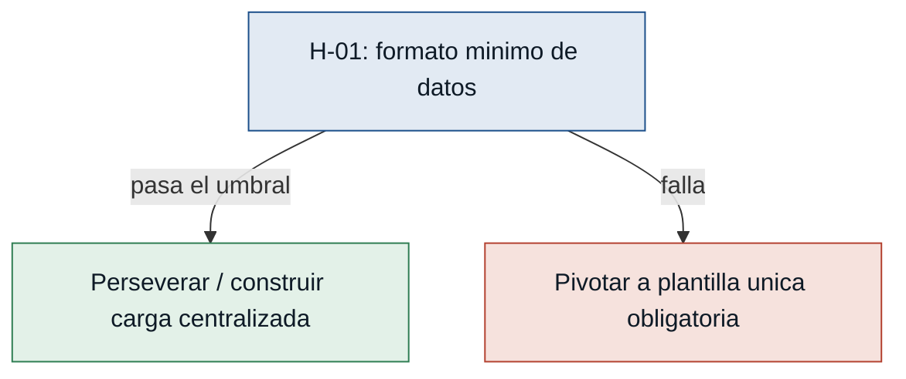

# Hipotesis y experimentos - cienciayfe_secr

### [H-01] Formato minimo de datos - riesgo: alto
- **Supuesto a probar:** La informacion academica de entrada puede cargarse con un formato minimo consistente para ejecutar validaciones utiles.
- **Hipotesis:** Creemos que secretaria podra detectar inconsistencias antes de generar documentos si al menos el 80% de los archivos de cierre se pueden cargar con columnas minimas comunes, porque el MVP depende de validar datos centralizados y no archivos dispersos.
- **Senal medible:** Porcentaje de archivos de cierre cargados con columnas minimas comunes sin preparacion manual adicional.
- **Criterio de exito:** Al menos 80% de 10 archivos reales o representativos se cargan correctamente en 2 horas de prueba.
- **Experimento:** Concierge tecnico: tomar 10 archivos reales o representativos del cierre, mapear columnas minimas y registrar cuantos se cargan sin limpieza manual adicional.
- **Caja de tiempo/costo:** 2 horas con secretaria y soporte tecnico.
- **Regla de decision:** Si pasa, mantener carga centralizada como base del MVP. Si falla, reducir alcance y definir primero una plantilla unica obligatoria antes de construir validaciones avanzadas.

### [H-02] Reglas de abanderados verificables - riesgo: alto
- **Supuesto a probar:** Las reglas para calcular y validar abanderados pueden expresarse de forma clara y verificable por secretaria y rectoria.
- **Hipotesis:** Creemos que secretaria y rectoria podran aprobar la validacion de abanderados si las reglas de promedios y orden se documentan en una matriz revisable, porque el principal riesgo es entregar reconocimientos con datos incorrectos.
- **Senal medible:** Porcentaje de reglas de abanderados confirmadas por secretaria y rectoria sin contradicciones.
- **Criterio de exito:** Al menos 90% de las reglas necesarias quedan confirmadas en una sesion de 60 minutos.
- **Experimento:** Entrevista dirigida con matriz de reglas: presentar una tabla de reglas de abanderados y pedir confirmacion, correccion o rechazo de cada regla.
- **Caja de tiempo/costo:** 60 minutos con secretaria y rectoria.
- **Regla de decision:** Si pasa, implementar validacion especifica de abanderados. Si falla, dejar abanderados como revision manual asistida y levantar evidencia normativa adicional antes de automatizar.

### [H-03] Estado listo para firma - riesgo: medio
- **Supuesto a probar:** Rectoria aceptara un estado de validacion como criterio practico para avanzar a firma.
- **Hipotesis:** Creemos que rectoria reducira devoluciones antes de firma si recibe documentos con estado de validacion y lista de inconsistencias cerradas, porque la firma requiere confianza en que los cuadros fueron revisados.
- **Senal medible:** Porcentaje de documentos simulados que rectoria acepta como listos para firma usando el estado de validacion.
- **Criterio de exito:** Al menos 4 de 5 documentos simulados son aceptados como listos para firma en una revision de 45 minutos.
- **Experimento:** Prototipo de baja fidelidad: mostrar 5 documentos simulados con estado de validacion, resumen de inconsistencias y version final para que rectoria decida si firmaria o devolveria.
- **Caja de tiempo/costo:** 45 minutos con rectoria.
- **Regla de decision:** Si pasa, incluir estado listo para firma en el MVP. Si falla, ajustar criterios visibles de validacion y mantener revision de rectoria como paso obligatorio sin bloqueo automatico.

### [H-04] Correcciones tardias trazables - riesgo: medio
- **Supuesto a probar:** Las correcciones tardias pueden detectarse y gestionarse sin rehacer manualmente todo el proceso.
- **Hipotesis:** Creemos que secretaria reducira reprocesos si el sistema marca avances afectados por correcciones posteriores, porque hoy los cambios tardios obligan a comparar archivos y revisar de nuevo.
- **Senal medible:** Porcentaje de correcciones tardias detectadas y asociadas al avance afectado.
- **Criterio de exito:** Al menos 8 de 10 correcciones simuladas se detectan y se vinculan al avance correcto en 1 hora.
- **Experimento:** Mago de Oz: simular 10 correcciones sobre avances existentes y registrar manualmente si el flujo propuesto permite marcar el avance afectado y la necesidad de revision.
- **Caja de tiempo/costo:** 1 hora con secretaria.
- **Regla de decision:** Si pasa, construir control basico de version vigente y alertas de cambio. Si falla, limitar el MVP a validacion inicial y documentar un procedimiento manual para correcciones tardias.

### [H-05] Medicion de devoluciones - riesgo: bajo
- **Supuesto a probar:** La metrica de devoluciones por inconsistencias antes de firma puede medirse durante el cierre academico.
- **Hipotesis:** Creemos que la institucion podra medir reduccion de devoluciones por inconsistencias si secretaria registra cada documento enviado a firma y cada devolucion, porque la metrica de exito del MVP depende de comparar devoluciones antes y despues.
- **Senal medible:** Porcentaje de documentos enviados a firma con estado registrado y resultado registrado.
- **Criterio de exito:** Al menos 95% de los documentos enviados a firma tienen resultado registrado durante 2 semanas de seguimiento.
- **Experimento:** Registro manual controlado: usar una hoja simple durante 2 semanas para anotar documentos enviados, devueltos y motivo de devolucion.
- **Caja de tiempo/costo:** 2 semanas de registro operativo liviano.
- **Regla de decision:** Si pasa, usar devoluciones por inconsistencias como metrica principal del MVP. Si falla, cambiar la metrica inicial a tiempo promedio de revision o numero de inconsistencias detectadas antes de firma.

