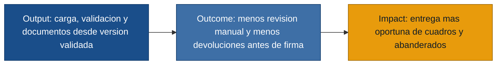

## MVP Canvas - Validador de cuadros academicos

| Bloque | Contenido |
|---|---|
| Propuesta de valor | Reducir retrasos y reprocesos en la entrega de cuadros finales, promociones y abanderados mediante una fuente central de datos, validacion de inconsistencias y generacion de documentos listos para revision. |
| Segmento de usuarios | Primero: secretaria academica y rectoria. Secundario: desarrollador de solucion como soporte tecnico del flujo. |
| Funcionalidades minimas | Carga centralizada de informacion academica por periodo; validacion de inconsistencias en nombres, cursos, promociones, promedios, datos faltantes y duplicados; validacion especifica para abanderados; control basico de version vigente; generacion de cuadros finales/promociones desde datos validados; estado "listo para firma" cuando no existan inconsistencias abiertas. |
| Resultado esperado (outcome) | Secretaria deja de comparar manualmente varias versiones antes de entregar, y rectoria recibe documentos con validacion previa antes de firmar. |
| Metrica de exito | Porcentaje de documentos devueltos por inconsistencias antes de firma. Exito inicial: reducir devoluciones por inconsistencias en al menos 50% durante el primer cierre academico usado con el MVP. |
| Riesgos / supuestos | La data de entrada puede no tener un formato uniforme; las reglas exactas para calcular abanderados deben confirmarse con la institucion; secretaria y rectoria deben aceptar el estado de validacion como criterio para avanzar a firma; pueden existir correcciones tardias despues de generar avances. |
| Fuera de alcance (por ahora) | Firma digital formal; integracion automatica con sistemas externos; portal para representantes o estudiantes; automatizacion completa del calculo normativo de abanderados sin validacion institucional; reportes historicos avanzados; gestion documental completa posterior a la firma. |

