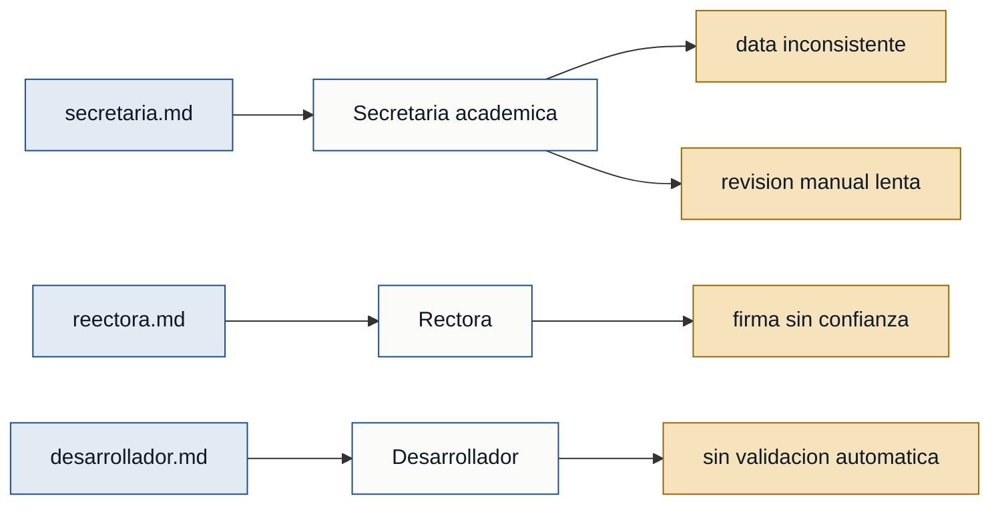

# Personas y stakeholders - cienciayfe_secr

## Personas

### Secretaria academica - secretaria
- **Contexto:** Responsable de preparar cuadros finales, promociones y datos de abanderados al cierre del periodo lectivo.
- **Objetivo principal:** Entregar documentos academicos correctos y listos para revision y firma de rectoria.
- **Dolores:** 
  - Debe revisar curso por curso y estudiante por estudiante antes de entregar los cuadros finales. (secretaria.md)
  - La informacion cambia o llega en versiones distintas, lo que obliga a rehacer avances ya trabajados. (secretaria.md)
  - Las inconsistencias en nombres, promedios, cursos y promociones retrasan la entrega. (secretaria.md)
  - La revision manual consume tiempo y obliga a comparar archivos y preguntar por correcciones. (secretaria.md)
- **Respaldo:** primera mano

### Rectora - rectora
- **Contexto:** Autoridad que valida con su firma los cuadros finales, promociones y abanderados.
- **Objetivo principal:** Firmar documentos oficiales confiables, revisados y sin inconsistencias.
- **Dolores:**
  - No puede firmar documentos si la informacion llega con errores o incompleta. (reectora.md)
  - La responsabilidad institucional recae en rectoria cuando un documento firmado contiene errores. (reectora.md)
  - El cierre del periodo 2025-2026 se cruza con avances del periodo 2026-2027. (reectora.md)
  - Necesita confianza en que secretaria trabaja con la version correcta de los documentos. (reectora.md)
- **Respaldo:** primera mano

### Desarrollador de solucion - desarrollador
- **Contexto:** Actor tecnico que entiende el proceso y propone centralizacion, validacion y generacion controlada de reportes.
- **Objetivo principal:** Reducir inconsistencias y reprocesos mediante una herramienta que valide la informacion antes de generar documentos.
- **Dolores:**
  - La informacion se maneja en avances y versiones separadas, lo que facilita trabajar con datos desactualizados. (desarrollador.md)
  - No existe una validacion automatica de datos faltantes, promedios incorrectos, duplicados o informacion incompleta de abanderados. (desarrollador.md)
  - La falta de control de versiones puede repetir el problema en el periodo 2026-2027. (desarrollador.md)
- **Respaldo:** primera mano

## Stakeholders

### Estudiantes reconocidos como abanderados
- **Interes en el sistema:** Que el calculo y orden de abanderados sea correcto, transparente y no afecte sus reconocimientos.
- **Fuente:** secretaria.md, reectora.md

### Representantes de estudiantes
- **Interes en el sistema:** Recibir resultados y documentos a tiempo, sin errores que provoquen reclamos o incertidumbre.
- **Fuente:** reectora.md, secretaria.md

### Institucion educativa
- **Interes en el sistema:** Proteger la validez de los documentos oficiales y evitar retrasos, reclamos y reprocesos al cierre del periodo.
- **Fuente:** reectora.md, secretaria.md, desarrollador.md

## Mapa de trazabilidad

